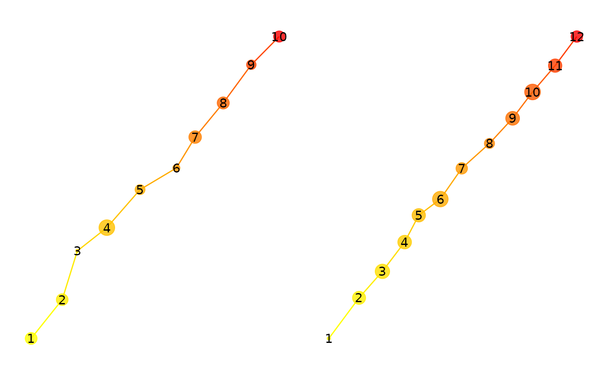
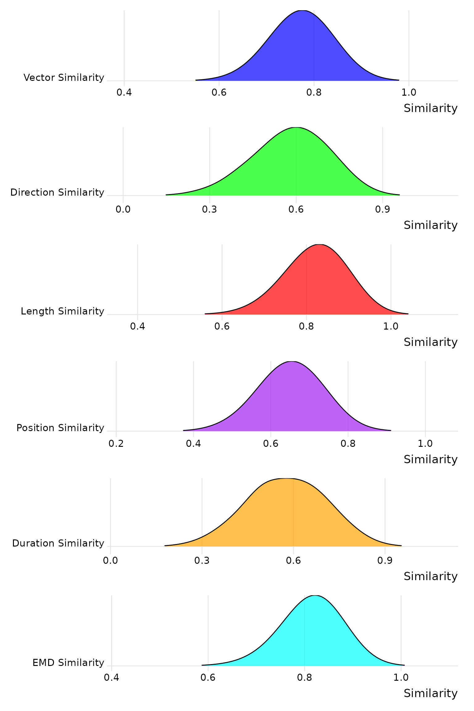
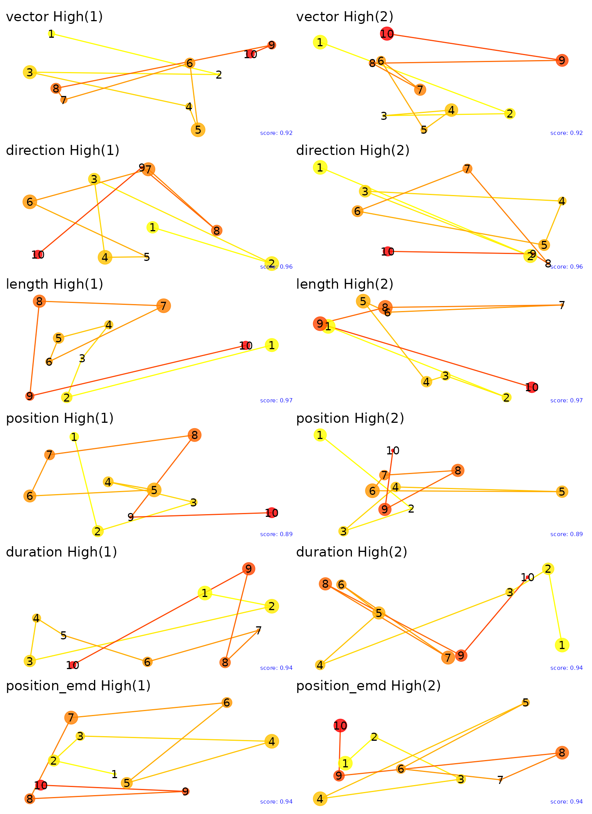
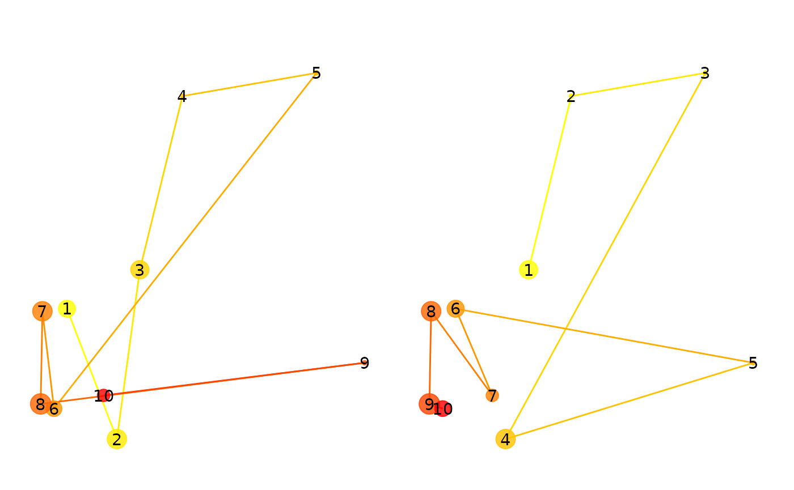

# Multimatch

## Multimatch

MultiMatch (Dewhurst et al. 2012) is a comprehensive method for
analyzing and comparing eye movement scanpaths. It evaluates scanpath
similarity across five dimensions: “vector”, “direction”, “length”,
“position”, and “duration”. By breaking down eye movements into these
distinct components, MultiMatch provides a detailed and nuanced
comparison of visual behavior. This method is particularly useful for
studies in psychology, cognitive science, and human-computer interaction
where understanding visual attention and patterns is crucial. In our
implementation, we add another metric based on the earth mover’s
distance (EMD; ‘position_emd’) between the positions of the fixations.
This should capture similarities in the distributions of the fixations
that are not order-specific.

Let’s simulate a simple eye-movement pattern and compare them with one
another.

``` r
# Simulate fixation data
simulate_fixations_linear <- function(n) {
  out <- data.frame(
    fixation = 1:n,
    x = cumsum(rnorm(n, mean = 50, sd = 10)),
    y = cumsum(rnorm(n, mean = 50, sd = 10)),
    duration = rpois(n, lambda = 200)
  )
  
  fixation_group(out$x, out$y, out$duration, out$fixation)
}

fixations1 <- simulate_fixations_linear(10)
fixations2 <- simulate_fixations_linear(12)

p1 <- plot(fixations1)
p2 <- plot(fixations2)
p1 + p2
```



Now, we will compare the two fixation groups using the `multimatch`
function.

``` r
sp1 <- scanpath(fixations1)
sp2 <- scanpath(fixations2)
eyesim:::multi_match(sp1, sp2, c(500,500))
```

    ##       mm_vector    mm_direction       mm_length     mm_position     mm_duration 
    ##       0.9943500       0.9850025       0.9936300       0.7375029       0.9701308 
    ## mm_position_emd 
    ##       0.9167082

All of the metrics give pretty high values, consistent with the known
similarity of the scanpaths.

``` r
# Simulate fixation data for each scenario
simulate_fixations_zigzag <- function() {
  out <- data.frame(
    fixation = 1:10,
    x = cumsum(c(50, 50, 50, 50, 50, 50, 50, 50, 50, 50)),
    y = cumsum(c(50, -50, 50, -50, 50, -50, 50, -50, 50, -50)),
    duration = rpois(10, lambda = 200)
  )
  fixation_group(out$x, out$y, out$duration, out$fixation)
}


fixations1_linear <- simulate_fixations_linear(10)
fixations2_zigzag <- simulate_fixations_zigzag()
sp1 <- scanpath(fixations1_linear)
sp2 <- scanpath(fixations2_zigzag)

eyesim:::multi_match(sp1, sp2, c(500,500))
```

    ##       mm_vector    mm_direction       mm_length     mm_position     mm_duration 
    ##       0.9683739       0.8029070       0.9913588       0.5708457       0.8874505 
    ## mm_position_emd 
    ##       0.6397256

We will simulate 8000 pairs of randomly generated scanpaths and show the
distribution of the similarity scores for each metric.

``` r
fgs <- replicate(8000, {
  fixations1 <- fixation_group(runif(10)*500, runif(10)*500, round(runif(10)*10)+1, 1:10)
  fixations2 <- fixation_group(runif(10)*500, runif(10)*500, round(runif(10)*10)+1, 1:10)
  list(fg1=fixations1, fg2=fixations2)
  #sp1 <- scanpath(fixations1)
  #sp2 <- scanpath(fixations2)
  #eyesim:::multi_match(sp1, sp2, c(500,500))
}, simplify=FALSE)

ssdf <- lapply(fgs, function(x) eyesim:::multi_match(scanpath(x$fg1), scanpath(x$fg2), c(500,500))) %>% bind_rows()
# Create ridgeline plots for each MultiMatch metric
ridgeline_vector <- ggplot(ssdf, aes(x = mm_vector, y = factor(1, labels = "Vector Similarity"))) + 
  geom_density_ridges(scale = 3, rel_min_height = 0.01, bandwidth = 0.05, fill = 'blue', color = 'black', alpha = 0.7) + 
  labs(x = 'Similarity', y = '') + theme_ridges() + theme(axis.title.y = element_blank())

ridgeline_direction <- ggplot(ssdf, aes(x = mm_direction, y = factor(1, labels = "Direction Similarity"))) + 
  geom_density_ridges(scale = 3, rel_min_height = 0.01, bandwidth = 0.05, fill = 'green', color = 'black', alpha = 0.7) + 
  labs(x = 'Similarity', y = '') + theme_ridges() + theme(axis.title.y = element_blank())

ridgeline_length <- ggplot(ssdf, aes(x = mm_length, y = factor(1, labels = "Length Similarity"))) + 
  geom_density_ridges(scale = 3, rel_min_height = 0.01, bandwidth = 0.05, fill = 'red', color = 'black', alpha = 0.7) + 
  labs(x = 'Similarity', y = '') + theme_ridges() + theme(axis.title.y = element_blank())

ridgeline_position <- ggplot(ssdf, aes(x = mm_position, y = factor(1, labels = "Position Similarity"))) + 
  geom_density_ridges(scale = 3, rel_min_height = 0.01, bandwidth = 0.05, fill = 'purple', color = 'black', alpha = 0.7) + 
  labs(x = 'Similarity', y = '') + theme_ridges() + theme(axis.title.y = element_blank())

ridgeline_duration <- ggplot(ssdf, aes(x = mm_duration, y = factor(1, labels = "Duration Similarity"))) + 
  geom_density_ridges(scale = 3, rel_min_height = 0.01, bandwidth = 0.05, fill = 'orange', color = 'black', alpha = 0.7) + 
  labs(x = 'Similarity', y = '') + theme_ridges() + theme(axis.title.y = element_blank())

ridgeline_emd <- ggplot(ssdf, aes(x = mm_position_emd, y = factor(1, labels = "EMD Similarity"))) + 
  geom_density_ridges(scale = 3, rel_min_height = 0.01, bandwidth = 0.05, fill = 'cyan', color = 'black', alpha = 0.7) + 
  labs(x = 'Similarity', y = '') + theme_ridges() + theme(axis.title.y = element_blank())

# Combine the ridgeline plots using patchwork
combined_plot <- ridgeline_vector / ridgeline_direction / ridgeline_length / ridgeline_position / ridgeline_duration / ridgeline_emd + 
  plot_layout(ncol = 1)

# Display the combined plot
print(combined_plot)
```



Let’s plot the fixations for the extreme values of the multimatch
metrics. By examining the highest and lowest pairs we can gain insight
into what each metric is capturing. Note that the size of points
captures duration of each fixation.

``` r
metrics <- c("vector", "direction", "length", "position", "duration", "position_emd")

extremes <- lapply(metrics, function(metric) {
  m <- paste0("mm_", metric)
  list(
    high = which.max(ssdf[[m]]),
    low = which.min(ssdf[[m]])
  )
})

names(extremes) <- metrics

# Function to create a plot for a fixation group with a title and annotation
plot_fixation_group <- function(fg, title, metric_value) {
  plot(fg) + 
    ggtitle(title) + 
    annotate("text", x = Inf, y = -Inf, label = paste("score:", round(metric_value, 2)), 
             hjust = 1.1, vjust = -1.1, size = 2, color = "blue")
}

# Create plots for each metric
plots <- lapply(names(extremes), function(metric) {
  high_index <- extremes[[metric]]$high
  low_index <- extremes[[metric]]$low
  
  metric_high_value <- ssdf[high_index, paste0("mm_", metric)]
  metric_low_value <- ssdf[low_index, paste0("mm_", metric)]

  high_fg1 <- fgs[[high_index]]$fg1
  high_fg2 <- fgs[[high_index]]$fg2
  low_fg1 <- fgs[[low_index]]$fg1
  low_fg2 <- fgs[[low_index]]$fg2

  high_plot1 <- plot_fixation_group(high_fg1, paste(metric, "High(1)"), metric_high_value)
  high_plot2 <- plot_fixation_group(high_fg2, paste(metric, "High(2)"), metric_high_value)
  low_plot1 <- plot_fixation_group(low_fg1, paste(metric, "Low(1)"), metric_low_value)
  low_plot2 <- plot_fixation_group(low_fg2, paste(metric, "Low(2)"), metric_low_value)

  list(high_plot = high_plot1 + high_plot2, low_plot = low_plot1 + low_plot2)
})

# Set the size of each plot
plot_height <- 12 # Adjust height as needed
plot_width <- 12 # Adjust width as needed

# Combine and arrange plots using patchwork
high_plots <- wrap_plots(
  plots[[1]]$high_plot,
  plots[[2]]$high_plot,
  plots[[3]]$high_plot,
  plots[[4]]$high_plot,
  plots[[5]]$high_plot,
  plots[[6]]$high_plot,
  nrow = 6
) + plot_layout(guides = 'collect', heights = rep(plot_height, 6)) + ggtitle("High MultiMatch Scores")

low_plots <- wrap_plots(
  plots[[1]]$low_plot,
  plots[[2]]$low_plot,
  plots[[3]]$low_plot,
  plots[[4]]$low_plot,
  plots[[5]]$low_plot,
  plots[[6]]$low_plot,
  nrow = 6
) + plot_layout(guides = 'collect', heights = rep(plot_height, 6)) + ggtitle("Low MultiMatch Scores")

# Save the plots to file
#ggsave("high_plots.png", plot = high_plots, height = plot_height * 5, width = plot_width, units = "in")
#ggsave("low_plots.png", plot = low_plots, height = plot_height * 5, width = plot_width, units = "in")
```

These are the highest pairs of scanpaths for each metric.

``` r
high_plots
```



And the lowest.

``` r
low_plots
```


## How transofrmations impact Multimatch metrics

Let’s generate a random scanpath and apply some transformations to it to
see how the multimatch metrics change.

``` r
fg <- fixation_group(runif(10)*500, runif(10)*500, round(runif(10)*10)+1, 1:10)

plot(fg) + plot(fg)
```


``` r
eyesim:::multi_match(scanpath(fg), scanpath(fg), c(500,500))
```

    ##       mm_vector    mm_direction       mm_length     mm_position     mm_duration 
    ##               1               1               1               1               1 
    ## mm_position_emd 
    ##               1

Now, we will scale the second scanpath by .5 and recompute the
multimatch metrics. You will notice that the “direction” metric remains
1, while position (especially) decreases dramatically. This is because
the absolute positions of the fixations are not preserved under scaling.

``` r
fg2 <- fg
fg2$y <- fg2$y * .5
fg2$x <- fg2$x * .5

p1 <- plot(fg) + ylim(0,500)
```

    ## Scale for y is already present.
    ## Adding another scale for y, which will replace the existing scale.

``` r
p2 <- plot(fg2) + ylim(0,500)
```

    ## Scale for y is already present.
    ## Adding another scale for y, which will replace the existing scale.

``` r
p1+p2
```


``` r
eyesim:::multi_match(scanpath(fg), scanpath(fg2), c(500,500))
```

    ##       mm_vector    mm_direction       mm_length     mm_position     mm_duration 
    ##       0.9300530       1.0000000       0.8601060       0.8158216       1.0000000 
    ## mm_position_emd 
    ##       0.8000760

Next we will preserve the positions of the fixations but scramble their
order. This will have a large impact on the “direction” metric, but not
on the other metrics. Note also the earth mover’s distance should remain
high.

``` r
fg2 <- fg
ord <- sample(1:nrow(fg2))
fg2$x <- fg2$x[ord]
fg2$y <- fg2$y[ord]
fg2$duration <- fg2$duration[ord]
p1 <- plot(fg) + ylim(0,500)
```

    ## Scale for y is already present.
    ## Adding another scale for y, which will replace the existing scale.

``` r
p2 <- plot(fg2) + ylim(0,500)
```

    ## Scale for y is already present.
    ## Adding another scale for y, which will replace the existing scale.

``` r
p1+p2
```



``` r
eyesim:::multi_match(scanpath(fg), scanpath(fg2), c(500,500))
```

    ##       mm_vector    mm_direction       mm_length     mm_position     mm_duration 
    ##       0.9011075       0.8539349       0.9909622       0.9365680       0.8944444 
    ## mm_position_emd 
    ##       0.9945680

## References

Dewhurst, R., Nyström, M., Jarodzka, H., Foulsham, T., Johansson, R., &
Holmqvist, K. (2012). It depends on how you look at it: Scanpath
comparison in multiple dimensions with MultiMatch, a vector-based
approach. Behavior Research Methods, 44, 1079-1100.
