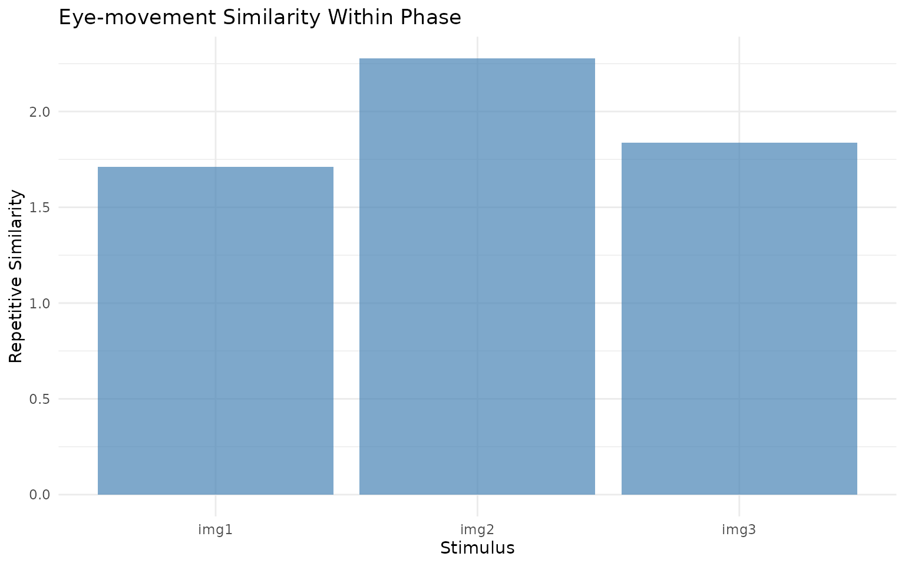
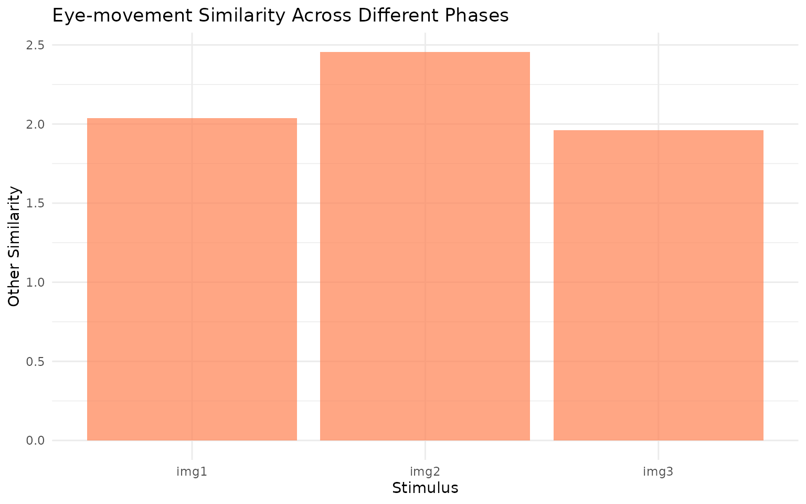

# Repetitive Similarity

``` r
if (requireNamespace("ggplot2", quietly = TRUE) && requireNamespace("albersdown", quietly = TRUE)) ggplot2::theme_set(albersdown::theme_albers(params$family))
library(eyesim)
library(dplyr)
library(ggplot2)
```

## Repetitive Similarity

The `repetitive_similarity` function computes eye-movement similarity
for datasets where the same stimulus is viewed multiple times across
experimental conditions. This is particularly useful for memory
experiments where images are presented during encoding and later during
retrieval phases.

Rather than comparing specific encoding-retrieval pairs, repetitive
similarity examines all possible within-stimulus combinations across
conditions and computes summary statistics (mean, median, etc.) to
characterize the overall similarity pattern.

## Example

Let’s simulate a simple dataset with images viewed during encoding and
retrieval:

``` r
# Generate sample fixation data
gen_fixations <- function(imname, phase, trial, participant) {
  nfix <- ceiling(runif(1) * 8) + 2  # 2-10 fixations
  cds <- data.frame(x = runif(nfix) * 100, y = runif(nfix) * 100)
  onset <- cumsum(runif(nfix) * 50)
  
  data.frame(
    x = cds$x, y = cds$y, onset = onset,
    duration = c(diff(onset), 50),
    image = imname, phase = phase, 
    trial = trial, participant = participant
  )
}

# Create dataset: 2 participants, 3 images, encoding + retrieval
df <- lapply(c("s1", "s2"), function(snum) {
  lapply(c("encoding", "retrieval"), function(phase) {
    lapply(paste0("img", 1:3), function(img) {
      gen_fixations(img, phase, img, snum)
    }) %>% bind_rows()
  }) %>% bind_rows()
}) %>% bind_rows()

# Create eye_table
eyetab <- eye_table("x", "y", "duration", "onset", 
                   groupvar = c("participant", "phase", "image"), 
                   data = df)

# Compute density maps
eyedens <- density_by(eyetab, groups = c("phase", "image", "participant"), 
                     sigma = 50, xbounds = c(0, 100), ybounds = c(0, 100))
```

Now compute repetitive similarity:

``` r
# Run repetitive similarity analysis
rep_sim <- repetitive_similarity(eyedens, 
                               condition_var = "phase",
                               method = "pearson")

print(rep_sim)
#> # A tibble: 12 × 7
#>    phase     image participant fixgroup           density        repsim othersim
#>    <chr>     <chr> <chr>       <list>             <list>          <dbl>    <dbl>
#>  1 encoding  img1  s1          <fxtn_grp [3 × 6]> <ey_dnsty [5]>  0.368    0.484
#>  2 encoding  img1  s2          <fxtn_grp [6 × 6]> <ey_dnsty [5]>  0.591    0.413
#>  3 encoding  img2  s1          <fxtn_grp [9 × 6]> <ey_dnsty [5]>  0.649    0.636
#>  4 encoding  img2  s2          <fxtn_grp [7 × 6]> <ey_dnsty [5]>  0.683    0.510
#>  5 encoding  img3  s1          <fxtn_grp [4 × 6]> <ey_dnsty [5]>  0.660    0.540
#>  6 encoding  img3  s2          <fxtn_grp [3 × 6]> <ey_dnsty [5]>  0.748    0.643
#>  7 retrieval img1  s1          <fxtn_grp [5 × 6]> <ey_dnsty [5]>  0.533    0.626
#>  8 retrieval img1  s2          <fxtn_grp [8 × 6]> <ey_dnsty [5]>  0.220    0.514
#>  9 retrieval img2  s1          <fxtn_grp [7 × 6]> <ey_dnsty [5]>  0.557    0.685
#> 10 retrieval img2  s2          <fxtn_grp [9 × 6]> <ey_dnsty [5]>  0.388    0.625
#> 11 retrieval img3  s1          <fxtn_grp [3 × 6]> <ey_dnsty [5]>  0.189    0.482
#> 12 retrieval img3  s2          <fxtn_grp [3 × 6]> <ey_dnsty [5]>  0.238    0.294
```

## Visualization

``` r
# Plot the similarity results
ggplot(rep_sim, aes(x = image, y = repsim)) +
  geom_col(fill = "steelblue", alpha = 0.7) +
  labs(x = "Stimulus", y = "Repetitive Similarity",
       title = "Eye-movement Similarity Within Phase") +
  theme_minimal()
```



``` r

# Also plot other similarity
ggplot(rep_sim, aes(x = image, y = othersim)) +
  geom_col(fill = "coral", alpha = 0.7) +
  labs(x = "Stimulus", y = "Other Similarity", 
       title = "Eye-movement Similarity Across Different Phases") +
  theme_minimal()
```



The `repetitive_similarity` function provides a straightforward way to
quantify how consistently participants look at the same locations when
viewing repeated stimuli across different experimental phases.
